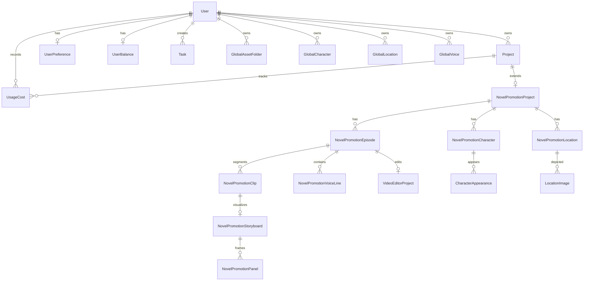
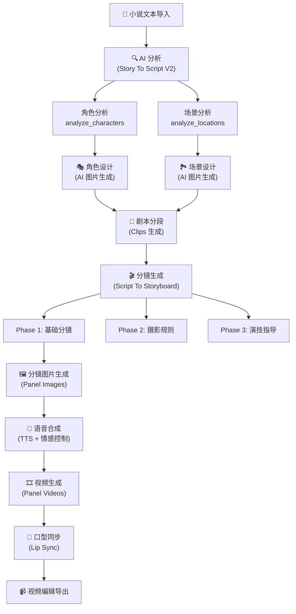
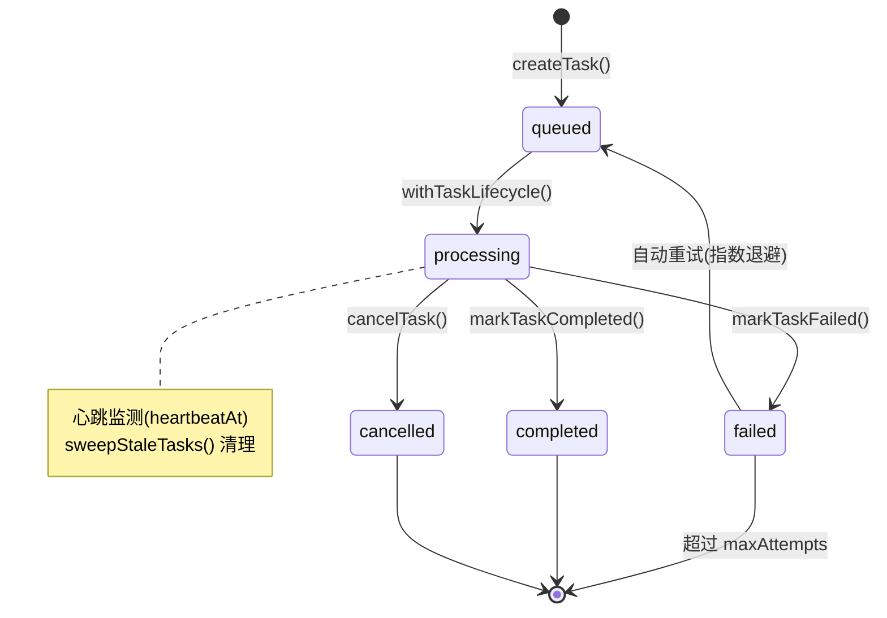
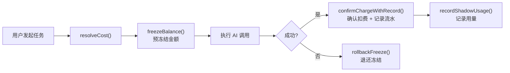

# waoowaoo 全链路技术分析文档

> 基于源码全量扫描的技术架构、数据层、API 接口、逻辑处理、AI 服务集成与优化建议

---

## 一、项目概况与技术栈

### 1.1 定位
AI 驱动的小说推广视频自动化制作平台。核心流程：**小说文本 → AI 分析 → 角色/场景设计 → 分镜脚本 → 图片生成 → 视频合成 → 语音配音 → 口型同步 → 最终视频导出**。

### 1.2 技术栈

| 层级 | 技术选型 | 说明 |
|---|---|---|
| **框架** | Next.js 15 (App Router) | 前后端一体 |
| **语言** | TypeScript | 全量类型 |
| **数据库** | MySQL 8.0 + Prisma ORM | 27 个模型，838 行 Schema |
| **队列** | Redis + BullMQ | 4 个 Worker 队列 |
| **状态管理** | React Query (TanStack) | 54 个 hooks/mutations |
| **样式** | Tailwind CSS + shadcn/ui | 28 个 UI 组件 |
| **认证** | NextAuth.js | 用户名/密码模式 |
| **存储** | 腾讯云 COS | 媒体文件云存储 |
| **国际化** | next-intl | 中/英双语 |
| **部署** | Docker Compose | MySQL + Redis + App |

---

## 二、数据层分析

### 2.1 核心数据模型 (27 Models)



### 2.2 模型分组

#### A. 认证与用户 (4)
| 模型 | 表名 | 说明 |
|---|---|---|
| `User` | `user` | 用户主表，关联所有业务实体 |
| `Account` / `Session` | `account` / `session` | NextAuth OAuth 认证 |
| `UserPreference` | `user_preferences` | 用户配置：AI 模型选择、API Key（加密）、默认参数 |

#### B. 项目与内容 (10)
| 模型 | 表名 | 核心字段 |
|---|---|---|
| `Project` | `projects` | `mode`(novel-promotion)、`userId` |
| `NovelPromotionProject` | `novel_promotion_projects` | 模型配置、画风、视频比例、TTS 语速 |
| `NovelPromotionEpisode` | `novel_promotion_episodes` | 剧集文本、SRT、语音 |
| `NovelPromotionClip` | `novel_promotion_clips` | 片段：内容、角色、场景、剧本 |
| `NovelPromotionShot` | `novel_promotion_shots` | 镜头：景别、机位、Prompt |
| `NovelPromotionStoryboard` | `novel_promotion_storyboards` | 分镜板：面板数、摄影规划 |
| `NovelPromotionPanel` | `novel_promotion_panels` | **核心实体**：图片/视频/口型同步 URL、Prompt、摄影规则 |
| `SupplementaryPanel` | `supplementary_panels` | 补充面板（插入/扩展） |
| `NovelPromotionCharacter` | `novel_promotion_characters` | 角色：名称、别名、声音、形象 |
| `NovelPromotionLocation` | `novel_promotion_locations` | 场景：名称、图片 |

#### C. 计费系统 (4)
| 模型 | 表名 | 说明 |
|---|---|---|
| `UserBalance` | `user_balances` | 余额 + 冻结金额 + 累计消费（Decimal 18,6） |
| `BalanceFreeze` | `balance_freezes` | 预冻结记录（幂等键去重） |
| `BalanceTransaction` | `balance_transactions` | 流水账本：充值、扣费、退款 |
| `UsageCost` | `usage_costs` | 用量明细（按 API 类型、模型、数量） |

#### D. 任务系统 (2)
| 模型 | 表名 | 说明 |
|---|---|---|
| `Task` | `tasks` | 异步任务：状态机(queued→processing→completed/failed)、心跳、重试 |
| `TaskEvent` | `task_events` | 任务事件流（进度/错误/完成） |

#### E. 全局资产中心 (6)
| 模型 | 表名 | 说明 |
|---|---|---|
| `GlobalAssetFolder` | `global_asset_folders` | 资产文件夹（一层扁平） |
| `GlobalCharacter` / `GlobalCharacterAppearance` | `global_characters` / `global_character_appearances` | 全局角色资产（跨项目复用） |
| `GlobalLocation` / `GlobalLocationImage` | `global_locations` / `global_location_images` | 全局场景资产 |
| `GlobalVoice` | `global_voices` | 全局音色库 |

#### F. 媒体层 (2)
| 模型 | 说明 |
|---|---|
| `MediaObject` | 统一媒体对象：COS 存储键、SHA256、MIME、尺寸、时长。关联 18 种业务实体 |
| `LegacyMediaRefBackup` | 迁移备份表 |

### 2.3 数据层优化建议

> [!WARNING]
> **高优先级问题**

1. **JSON 字段过度使用** — `characters`、`imageHistory`、`candidateImages`、`photographyRules`、`actingNotes` 等大量使用 `@db.Text` 存 JSON 字符串。无法建索引、无法做关联查询。建议对高频查询字段拆为独立表。
2. **`NovelPromotionPanel` 字段膨胀** — 单表 30+ 字段，包含图片、视频、口型同步、草图等所有媒体态。建议拆分为 `PanelMedia`（1:N）关系。
3. **`UserPreference` 同时存 API Key 和 JSON 模型配置** — 职责混杂。建议拆分 `UserApiConfig` 和 `UserModelConfig` 两个表。
4. **双套资产体系** — `NovelPromotionCharacter` vs `GlobalCharacter` 结构近乎一致，通过 `sourceGlobalCharacterId` 松耦合。可以考虑统一为一套资产 + scope 标签。

---

## 三、页面路由分析

### 3.1 前端页面结构

```
src/app/[locale]/
├── auth/                     # 认证
│   ├── login/                # 登录
│   └── signup/               # 注册
├── profile/                  # 用户设置（API Key、模型配置）
└── workspace/                # 工作区
    ├── page.tsx              # 项目列表（25K）
    ├── asset-hub/            # 全局资产中心（19 子文件）
    └── [projectId]/          # 项目详情
        ├── page.tsx          # 项目工作台（13K）
        └── modes/            # 工作模式（200 子文件）
            └── novel-promotion/  # 小说推广模式
```

### 3.2 工作台模式结构

小说推广模式下的核心页面阶段：

```
故事 (Story) → 剧本 (Script) → 分镜 (Storyboard) → 语音 (Voice) → 视频 (Video) → 编辑导出 (Editor)
```

每个阶段对应独立的 UI 组件和 runtime 逻辑：
- **故事** — 文本输入/导入 + AI 分析触发
- **剧本** — AI 生成的剧本片段(Clip)浏览/编辑
- **分镜** — AI 分镜板(Panel)图片 + Prompt 编辑 + 重新生成
- **语音** — TTS 语音合成 + 情感控制 + SRT 字幕
- **视频** — 视频生成 + 口型同步(Lip Sync)
- **编辑** — 视频剪辑器(VideoEditorProject)

---

## 四、API 接口分析

### 4.1 API 路由总览 (81 Routes)

#### A. 认证 (2)
| 路由 | 方法 | 说明 |
|---|---|---|
| `/api/auth/[...nextauth]` | GET/POST | NextAuth 处理器 |
| `/api/auth/register` | POST | 用户注册 |

#### B. 用户配置 (1)
| 路由 | 方法 | 说明 |
|---|---|---|
| `/api/user/api-config` | GET/PUT | 模型配置 CRUD（含 Provider、Default Models、Capability 选择） |

#### C. 资产中心 (26)
包括角色、场景、音色、文件夹的 CRUD，以及 AI 设计/修改功能：

| 类别 | 路由数 | 关键操作 |
|---|---|---|
| 角色管理 | 6 | CRUD + 形象管理 + AI 设计 |
| 场景管理 | 4 | CRUD + 图片选择 |
| 音色管理 | 4 | CRUD + 上传 + AI 声音设计 |
| 图片操作 | 8 | 生成 + 修改 + 上传 + 撤回 + 标签 |
| 文件夹 | 2 | CRUD |
| 其他 | 2 | Picker + 引用转角色 |

#### D. 小说推广核心 (50+)
| 类别 | 路由 | 说明 |
|---|---|---|
| **AI 分析** | `analyze`, `analyze-global` | 小说文本 → 角色/场景分析 |
| **角色** | `character/*`, `character-profile/*` | 角色 CRUD + 形象确认 + 批量操作 |
| **语音** | `character-voice`, `voice-analyze`, `voice-design`, `voice-lines/*` | 语音分析/设计/TTS 生成 |
| **剧本** | `clips/*`, `screenplay-convert` | 片段 CRUD + 剧本转换 |
| **分镜** | `storyboard/*`, `panels/*` | 分镜生成 + 面板操作 + Shot AI |
| **图片** | `generate-image`, `modify-image`, `regenerate-image` | 面板图片生成/修改 |
| **视频** | `generate-video`, `lip-sync` | 视频生成 + 口型同步 |
| **导出** | `download-images`, `clips/build` | 批量下载 + 视频构建 |
| **项目** | `episode/*`, `import`, `config`, `stats` | 剧集管理 + 导入 + 配置 |

#### E. 其他 (2)
| 路由 | 说明 |
|---|---|
| `/api/cos/image` | COS 图片代理 |
| `/api/files/[...path]` | 静态文件服务 |

### 4.2 通用 API 模式

```typescript
// 1. apiHandler 统一封装
export const POST = apiHandler(async (request: NextRequest) => {
  // 认证检查
  const authResult = await requireUserAuth()
  // 参数解析 + 验证
  const body = await request.json()
  // 计费检查（如需要）
  const billingResult = handleBillingError(error)
  // 业务逻辑
  // ...
  return NextResponse.json({ success: true, data })
})

// 2. 异步任务模式（图片/视频/语音）
// API 创建 Task → BullMQ 入队 → Worker 处理 → SSE 推送进度
```

---

## 五、核心业务逻辑（全链路）

### 5.1 主流程（Pipeline）



### 5.2 Worker 架构

```
4 个 BullMQ Worker 队列并行处理：

┌─────────────────────────────────────────────────┐
│                 BullMQ (Redis)                   │
│  ┌──────────────┐  ┌───────────┐  ┌───────────┐ │
│  │ waoowaoo-text│  │waoowaoo-  │  │waoowaoo-  │ │
│  │   Queue      │  │image Queue│  │video Queue│ │
│  └──────┬───────┘  └─────┬─────┘  └─────┬─────┘ │
│         │                │              │        │
│  ┌──────▼───────┐  ┌─────▼─────┐  ┌─────▼─────┐ │
│  │ Text Worker  │  │Image      │  │Video      │ │
│  │ (658 lines)  │  │Worker     │  │Worker     │ │
│  └──────────────┘  └───────────┘  └───────────┘ │
│                                                  │
│  ┌──────────────┐                                │
│  │Voice Worker  │   + waoowaoo-voice Queue       │
│  └──────────────┘                                │
└─────────────────────────────────────────────────┘
```

#### Text Worker — 43 个 Handler（最核心）

| Handler | 说明 |
|---|---|
| `story-to-script` | 小说 → 角色/场景/剧本分析（LLM 流式调用） |
| `script-to-storyboard` | 剧本 → 分镜（3 Phase） |
| `analyze-novel` | 小说全文分析（多剧集拆分） |
| `analyze-global` | 全局资产分析 |
| `episode-split` | 剧集拆分 |
| `screenplay-convert` | 剧本格式转换 |
| `clips-build` | 视频片段构建 |
| `character-profile` | 角色档案生成 |
| `voice-analyze` / `voice-design` | 语音分析/设计 |
| `llm-proxy` / `llm-stream` | LLM 代理/流式 |
| `image-task-handlers-core` | 图片生成统一入口 |
| `shot-ai-*` | 镜头 AI 生成 |
| `reference-to-character` | 引用图片转角色 |

#### Image Worker
调用 `createImageGenerator(provider)` → 生成图片 → 上传 COS → 更新 Panel

#### Video Worker
- `handleVideoPanelTask` — 面板视频生成（支持 normal/firstlastframe 两种模式）
- `handleLipSyncTask` — 口型同步（Kling/Vidu）

#### Voice Worker
TTS 语音合成（Qwen、CosyVoice2 等）

### 5.3 任务生命周期



**关键设计**：`withTaskLifecycle` (579 行) 是所有 Worker 的统一包装器，负责：
- 标记 processing → 执行 handler → 标记 completed/failed
- 计费集成（冻结 → 执行 → 确认/退款）
- 重试策略（指数退避，区分可重试/不可重试错误）
- 心跳更新
- 流式进度上报
- 日志记录

---

## 六、AI 服务集成

### 6.1 多 Provider 适配架构

```
                    ┌──────────────────────┐
                    │    Generator Factory  │
                    │    (factory.ts)       │
                    └──────────┬───────────┘
         ┌──────────┬─────────┼──────────┬──────────┐
         ▼          ▼         ▼          ▼          ▼
    ┌────────┐ ┌────────┐ ┌────────┐ ┌────────┐ ┌────────┐
    │ Google │ │  Ark   │ │  FAL   │ │MiniMax │ │  Vidu  │
    │Gemini  │ │Volcano │ │ Kling  │ │ 海螺   │ │ 生数   │
    │Image+  │ │Seedream│ │Image+  │ │ Video  │ │ Video+ │
    │Video+  │ │+Seedan.│ │Video   │ │        │ │ Audio  │
    │  LLM   │ │+ LLM   │ │        │ │        │ │+LipSync│
    └────────┘ └────────┘ └────────┘ └────────┘ └────────┘
```

### 6.2 LLM 调用链 (`chat-completion.ts` 389 行)

```typescript
chatCompletion(userId, model, messages, options)
  → resolveLlmRuntimeModel()     // 解析模型 → provider + modelId
  → getProviderKey()              // 提取 provider 主键
  ↓
  switch (providerKey):
    'google' / 'gemini-compatible'  → GoogleGenAI SDK (原生)
    'ark'                           → OpenAI SDK (火山引擎 Base URL)
    'openrouter' / 其他             → OpenAI SDK / AI SDK
  ↓
  → 重试逻辑 (maxRetries, 指数退避)
  → 用量记录 (recordCompletionUsage)
  → 日志 (logLlmRawInput/Output)
```

**流式调用** (`chat-stream.ts` 26K) 支持实时进度推送到前端。

### 6.3 图片生成器

| Provider | 类 | 模型 |
|---|---|---|
| Google | `GoogleGeminiImageGenerator` | Banana Pro (gemini-3-pro-image) |
| Google | `GoogleImagenGenerator` | Imagen 4 / Ultra / Fast |
| Google | `GoogleGeminiBatchImageGenerator` | Batch 异步模式 |
| Ark | `ArkSeedreamGenerator` | Seedream |
| FAL | `FalBananaGenerator` | FAL Banana |
| Gemini-Compatible | `GeminiCompatibleImageGenerator` | 第三方兼容 |

### 6.4 视频生成器

| Provider | 类 | 模型 |
|---|---|---|
| Google | `GoogleVeoVideoGenerator` | Veo 2.0/3.0/3.1 |
| Ark | `ArkSeedanceVideoGenerator` | Seedance |
| FAL | `FalVideoGenerator` | Kling |
| MiniMax | `MinimaxVideoGenerator` | 海螺 |
| Vidu | `ViduVideoGenerator` | Vidu |

### 6.5 语音生成器

| Provider | 类 | 说明 |
|---|---|---|
| Qwen | `QwenTTSGenerator` | 阿里百炼 TTS (CosyVoice2) |

### 6.6 AI 服务集成优化建议

> [!IMPORTANT]
> **关键优化点**

1. **缺乏统一的 Provider Health Check** — 当 Google API 返回 503 时，没有自动降级到其他 Provider 的机制
2. **重试逻辑分散** — LLM、图片、视频各有独立重试逻辑，应统一为装饰器模式
3. **缺少请求限流** — 无 Rate Limiter，大量并发请求可能被 Provider 封禁
4. **模型定价硬编码** — 内置的定价目录(`model-pricing/`)需要随 API 价格调整手动更新

---

## 七、计费系统

### 7.1 计费架构



### 7.2 计费函数族

| 函数 | 用途 | 计量单位 |
|---|---|---|
| `withTextBilling` | LLM 调用 | Token (input + output) |
| `withImageBilling` | 图片生成 | 张数 |
| `withVideoBilling` | 视频生成 | 分辨率 × 次数 |
| `withVoiceBilling` | 语音合成 | 秒数 |
| `withVoiceDesignBilling` | 声音设计 | 次数 |
| `withLipSyncBilling` | 口型同步 | 次数 |

### 7.3 计费模式

- **`BILLING`** — 完整计费：预冻结 → 执行 → 确认扣费/退款
- **`SHADOW`** — 影子计费：仅记录用量，不扣余额
- **`OFF`** — 关闭计费

### 7.4 定价体系 (`model-pricing/`)

内置定价目录，支持：
- 按 Token 计费（文本模型：input/output 分别定价）
- 按次计费（图片/视频/语音）
- 按分辨率分层定价（视频）
- 用户自定义定价覆盖（`customPricing`）

---

## 八、前端架构

### 8.1 状态管理 — React Query

```
src/lib/query/
├── client.ts          # QueryClient 配置
├── keys.ts            # 查询键常量（4K）
├── hooks/ (24)        # 数据查询 Hooks
│   ├── useProject.ts
│   ├── useEpisode.ts
│   ├── useCharacters.ts
│   ├── useStoryboard.ts
│   ├── useVoiceLines.ts
│   └── ...
└── mutations/ (30)    # 数据变更 Mutations
    ├── useCreateProject.ts
    ├── useGenerateImage.ts
    ├── useGenerateVideo.ts
    └── ...
```

### 8.2 组件体系

```
src/components/
├── ui/ (28)           # shadcn/ui 基础组件
├── shared/ (9)        # 共享业务组件
├── task/ (2)          # 任务进度组件
├── media/ (2)         # 媒体展示组件
├── voice/ (1)         # 语音组件
├── llm-console/ (2)   # LLM 调试控制台
└── Navbar / LanguageSwitcher / ConfirmDialog / ProgressToast
```

### 8.3 Feature 模块

```
src/features/
└── video-editor/ (14) # 视频编辑器（独立 Feature）
```

---

## 九、基础设施

### 9.1 Docker 部署架构

```yaml
services:
  mysql:     # MySQL 8.0 (端口 13306)
  redis:     # Redis 7 (端口 16379)
  app:       # Next.js + BullMQ Workers (端口 13000)
```

**单进程模式**：应用和所有 4 个 Worker 运行在同一个 Node.js 进程中。

### 9.2 日志系统 (`src/lib/logging/`)

```
logging/
├── core.ts          # 结构化 JSON 日志
├── context.ts       # 请求上下文
├── file-writer.ts   # 文件日志写入
└── ...
```

### 9.3 SSE 实时通信 (`src/lib/sse/`)

任务进度通过 Server-Sent Events 推送到前端。

### 9.4 媒体处理 (`src/lib/media/`)

统一的 `MediaObject` 模型管理所有二进制资产，通过 COS 云存储持久化。

---

## 十、全链路优化建议

### 10.1 架构层

| 序号 | 问题 | 建议 | 优先级 |
|---|---|---|---|
| 1 | 单进程跑 Web + 4 Workers | 拆分为独立的 Worker 进程/容器，支持水平扩展 | ⭐⭐⭐ |
| 2 | 无 API Gateway / Rate Limiting | 接入 Nginx + 限流中间件 | ⭐⭐⭐ |
| 3 | 无缓存层 | 高频查询（角色/场景列表）加 Redis 缓存 | ⭐⭐ |
| 4 | 无健康检查端点 | 添加 `/health` + `/ready` 端点 | ⭐⭐ |

### 10.2 数据层

| 序号 | 问题 | 建议 | 优先级 |
|---|---|---|---|
| 1 | JSON 字段过多无法查询 | 核心字段拆表（如 `candidateImages`、`photographyRules`） | ⭐⭐⭐ |
| 2 | `Panel` 表字段膨胀 (30+) | 拆分 `PanelMedia`（图片/视频/口型同步） | ⭐⭐ |
| 3 | 双套资产体系冗余 | 统一为 `Asset` + `scope` 字段 | ⭐⭐ |
| 4 | 无数据库分页优化 | 大表查询加 cursor-based pagination | ⭐ |

### 10.3 AI 服务层

| 序号 | 问题 | 建议 | 优先级 |
|---|---|---|---|
| 1 | 无 Provider 降级策略 | 实现 Fallback Chain（如 Google 503 → Ark） | ⭐⭐⭐ |
| 2 | 无请求限流 | 实现 Token Bucket / Sliding Window 限流 | ⭐⭐⭐ |
| 3 | 重试逻辑分散 | 统一重试装饰器 + Circuit Breaker | ⭐⭐ |
| 4 | LLM Prompt 硬编码 | 提取为可配置的 Prompt 模板 | ⭐⭐ |
| 5 | 定价目录手动维护 | 增加定价 API 自动更新机制 | ⭐ |

### 10.4 计费层

| 序号 | 问题 | 建议 | 优先级 |
|---|---|---|---|
| 1 | `validateDefaultModelPricing` 不检查 customPricing | **已修复** ✅ | — |
| 2 | 冻结无超时清理 | `BalanceFreeze` 添加 `expiresAt` 定时清理 | ⭐⭐ |
| 3 | 无计费仪表盘 | 添加用量统计 API + 可视化面板 | ⭐ |

### 10.5 前端层

| 序号 | 问题 | 建议 | 优先级 |
|---|---|---|---|
| 1 | 页面文件过大 (`page.tsx` 25K) | 拆分为更小的组件 | ⭐⭐ |
| 2 | 无错误边界 | 添加 React Error Boundary | ⭐⭐ |
| 3 | 无 Loading Skeleton | 列表页添加骨架屏 | ⭐ |
| 4 | 无离线提示 | 添加网络状态检测 | ⭐ |

### 10.6 运维层

| 序号 | 问题 | 建议 | 优先级 |
|---|---|---|---|
| 1 | 无 APM 监控 | 接入 Prometheus + Grafana | ⭐⭐⭐ |
| 2 | 无告警机制 | Task 失败率 / API 错误率告警 | ⭐⭐ |
| 3 | 无自动备份 | MySQL 定时备份 + COS 备份 | ⭐⭐ |
| 4 | Docker 单节点 | 考虑 K8s / Docker Swarm 多节点部署 | ⭐ |

---

## 附录 A：API 路由完整清单

<details>
<summary>点击展开 81 个 API 路由</summary>

**认证**
- `POST /api/auth/register`
- `GET/POST /api/auth/[...nextauth]`

**用户配置**
- `GET/PUT /api/user/api-config`

**资产中心 (26)**
- `POST /api/asset-hub/ai-design-character`
- `POST /api/asset-hub/ai-design-location`
- `POST /api/asset-hub/ai-modify-character`
- `POST /api/asset-hub/ai-modify-location`
- `GET /api/asset-hub/appearances`
- `POST /api/asset-hub/character-voice`
- `GET/PUT/DELETE /api/asset-hub/characters/[characterId]`
- `PUT /api/asset-hub/characters/[characterId]/appearances/[appearanceIndex]`
- `GET/POST /api/asset-hub/characters`
- `GET/PUT/DELETE /api/asset-hub/folders/[folderId]`
- `GET/POST /api/asset-hub/folders`
- `POST /api/asset-hub/generate-image`
- `GET/PUT/DELETE /api/asset-hub/locations/[locationId]`
- `GET/POST /api/asset-hub/locations`
- `POST /api/asset-hub/modify-image`
- `GET /api/asset-hub/picker`
- `POST /api/asset-hub/reference-to-character`
- `POST /api/asset-hub/select-image`
- `POST /api/asset-hub/undo-image`
- `POST /api/asset-hub/update-asset-label`
- `POST /api/asset-hub/upload-image`
- `POST /api/asset-hub/upload-temp`
- `POST /api/asset-hub/voice-design`
- `GET/PUT/DELETE /api/asset-hub/voices/[id]`
- `GET/POST /api/asset-hub/voices`
- `POST /api/asset-hub/voices/upload`

**小说推广 (50+)**
- `POST /api/novel-promotion/[projectId]/analyze`
- `POST /api/novel-promotion/[projectId]/analyze-global`
- `POST /api/novel-promotion/[projectId]/ai-create-character`
- `POST /api/novel-promotion/[projectId]/ai-create-location`
- `POST /api/novel-promotion/[projectId]/ai-modify-appearance`
- `POST /api/novel-promotion/[projectId]/ai-modify-location`
- `POST /api/novel-promotion/[projectId]/ai-modify-shot-prompt`
- `POST /api/novel-promotion/[projectId]/analyze-shot-variants`
- `GET /api/novel-promotion/[projectId]/assets`
- `POST /api/novel-promotion/[projectId]/character/appearance`
- `POST /api/novel-promotion/[projectId]/character/confirm-selection`
- `GET/POST /api/novel-promotion/[projectId]/character`
- `POST /api/novel-promotion/[projectId]/character-profile/batch-confirm`
- `POST /api/novel-promotion/[projectId]/character-profile/confirm`
- `POST /api/novel-promotion/[projectId]/character-voice`
- `POST /api/novel-promotion/[projectId]/cleanup-unselected-images`
- `GET/PUT/DELETE /api/novel-promotion/[projectId]/clips/[clipId]`
- `GET/POST /api/novel-promotion/[projectId]/clips`
- `POST /api/novel-promotion/[projectId]/clips/build`
- `POST /api/novel-promotion/[projectId]/copy-from-global`
- `POST /api/novel-promotion/[projectId]/download-images`
- *(其他 30+ 路由见源码)*

**其他**
- `GET /api/cos/image`
- `GET /api/files/[...path]`

</details>

---

## 附录 B：源码文件规模 Top 15

| 文件 | 大小 | 说明 |
|---|---|---|
| `prisma/schema.prisma` | 34.5K | 数据模型定义 |
| `billing/service.ts` | 26.2K | 计费服务核心 |
| `cos.ts` | 27.0K | COS 存储操作 |
| `workers/text.worker.ts` | 25.1K | 文本 Worker |
| `workspace/page.tsx` | 25.6K | 工作区页面 |
| `storyboard-phases.ts` | 24.4K | 分镜三阶段 |
| `generators/vidu.ts` | 24.4K | Vidu 生成器 |
| `api-errors.ts` | 19.7K | 错误定义 |
| `workers/shared.ts` | 18.9K | Worker 共享逻辑 |
| `workers/utils.ts` | 17.7K | Worker 工具 |
| `ark-api.ts` | 17.1K | 火山引擎 API |
| `novel-promotion/stages/*` | 27.6K | 阶段 Runtime |
| `model-config-contract.ts` | 16.4K | 模型配置契约 |
| `billing/ledger.ts` | 15.6K | 计费账本 |
| `llm/chat-completion.ts` | 13.7K | LLM 调用 |
